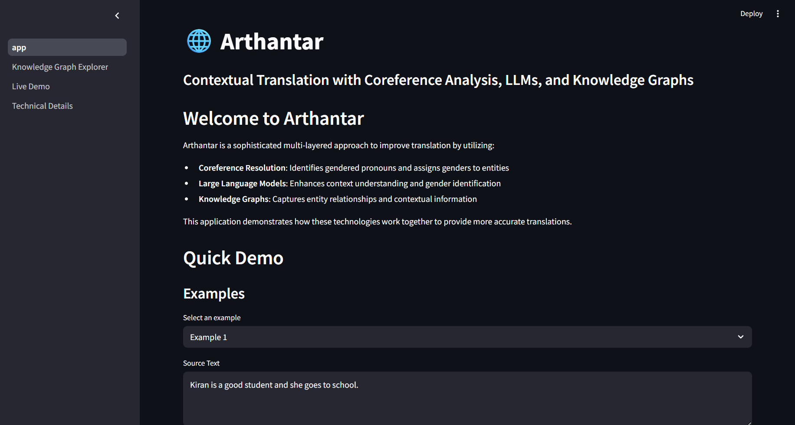
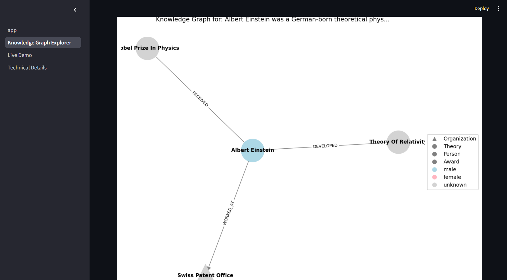

# Technical Details - Arthantar

## Understanding the Arthantar System

Arthantar is a contextual translation system that uses a multi-layered approach to enhance translations. The system integrates gender identification, knowledge graph generation, coreference resolution, and specialized translation prompts to ensure accurate and semantically-preserved translations. Below is a detailed explanation of the system components, architecture, and translation process.

### System Architecture

#### Multi-Layered Approach

Arthantar implements a sophisticated multi-layered approach to improve translation by utilizing:

1. **Gender Identification Layer**
   - **Primary**: FCoref module for coreference resolution
   - **Backup**: LLM-based gender prediction using Groq API

2. **Knowledge Graph Generation Layer**
   - **Primary**: LLMGraphTransformer with Groq API
   - **Backup**: spaCy-based entity and relationship extraction
   - **Fallback**: Basic entity extraction using capitalized words

3. **Translation Enhancement Layer**
   - Contextual prompt generation with knowledge graph metadata
   - Gender and relationship-aware translation

#### System Components

- **FCoref**: State-of-the-art coreference resolution
- **Groq API**: LLM integration for various tasks
- **LangChain**: Framework for LLM applications
- **spaCy**: NLP toolkit for backup processing
- **NetworkX**: Graph operations and analysis
- **Streamlit**: Interactive web interface

#### Fallback Mechanisms

The system implements multiple fallback mechanisms to ensure robustness:

1. If coreference resolution fails → Use LLM for gender prediction
2. If LLM graph generation fails → Use spaCy-based graph generation
3. If spaCy processing fails → Use basic entity extraction

This ensures that even in challenging scenarios, the system can still provide useful translations with contextual awareness.

### Coreference Resolution

Coreference resolution is the task of finding all expressions that refer to the same entity in a text. In Arthantar, we use the FCoref module, which identifies clusters of related pronouns and assigns genders to entities based on context.

#### Gender Identification Process

1. The text is analyzed to identify clusters of related mentions
2. Each cluster is checked for gendered pronouns (he/him/his or she/her/hers)
3. If a cluster contains gendered pronouns, all entities in that cluster are assigned the corresponding gender
4. For entities without clear gender indicators, the LLM is used as a backup

#### Challenges in Coreference Resolution

- **Ambiguous Pronouns**: When pronouns could refer to multiple entities
- **Implicit References**: When entities are referenced without explicit pronouns
- **Cross-Cultural Names**: Names that may be used for different genders in different cultures

Arthantar addresses these challenges through its multi-layered approach and fallback mechanisms.

### Knowledge Graph Generation

A knowledge graph represents entities and their relationships in a structured format. In Arthantar, our knowledge graphs contain:

- **Nodes**: Representing entities with attributes like type and gender
- **Relationships**: Representing connections between entities

#### Generation Process

1. **Primary Method**: Using LLMGraphTransformer with Groq API
   - Text is processed by the LLM to extract entities and relationships
   - Gender information is added from coreference resolution
   - A structured graph is created using NetworkX

2. **Backup Method**: Using spaCy NLP
   - Named Entity Recognition (NER) identifies entities
   - Dependency parsing identifies relationships
   - Gender information is added from coreference or LLM prediction

3. **Fallback Method**: Basic entity extraction
   - Capitalized words are treated as entities
   - Sequential relationships are created
   - Gender information is added where available

### Translation Process

Arthantar enhances translation by incorporating contextual information from the knowledge graph:

1. **Prompt Generation**
   - The knowledge graph is converted to a metadata string
   - This metadata includes entity types, genders, and relationships
   - A specialized prompt is created for the LLM

2. **Translation with Context**
   - The LLM uses the knowledge graph metadata to inform translation
   - Gender information ensures proper gender agreement in the target language
   - Relationship information preserves semantic connections

3. **Advantages Over Standard Translation**
   - **Gender Accuracy**: Correctly handles gendered pronouns and agreements
   - **Contextual Awareness**: Understands entity relationships
   - **Semantic Preservation**: Maintains meaning across languages

### Future Improvements

- **Multi-language Support**: Extend beyond Hindi to other languages
- **Enhanced Entity Recognition**: Improve identification of complex entities
- **Relationship Extraction**: Develop more sophisticated relationship detection
- **Performance Optimization**: Reduce processing time for real-time applications

---

Arthantar - Contextual Translation System
